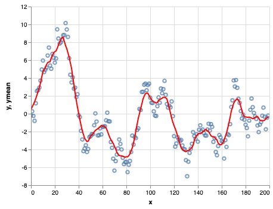

# altair-transform

Python evaluation of Altair/Vega-Lite transforms.

[](https://travis-ci.org/jakevdp/altair-transform)

## Example

The Vega-Lite specification includes the ability to apply a
wide range of transformations to input data within the chart
specification. As an example, here is a sliding window average
of a Gaussian random walk, implemented in Altair:

```python
import altair as alt
import numpy as np
import pandas as pd

rand = np.random.RandomState(12345)

df = pd.DataFrame({
    'x': np.arange(200),
    'y': rand.randn(200).cumsum()
})

points = alt.Chart(df).mark_point().encode(
    x='x:Q',
    y='y:Q'
)

line = alt.Chart(df).transform_window(
    ymean='mean(y)',
    sort=[alt.SortField('x')],
    frame=[5, 5]
).mark_line(color='red').encode(
    x='x:Q',
    y='ymean:Q'
)

points + line
```


Because the transform is encoded within the renderer, however, it
is not easy from Altair to access the computed values.

This is where ``altair_transform`` comes in. It includes a (nearly)
complete Python implementation of Vega-Lite's transform layer, so
that you can easily extract a pandas dataframe with the computed
values shown in the chart:

```python
from altair_transform import extract_data
data = extract_data(line)
data.head()
```
<table border="0" class="dataframe">
  <thead>
    <tr style="text-align: right;">
      <th></th>
      <th>x</th>
      <th>y</th>
      <th>ymean</th>
    </tr>
  </thead>
  <tbody>
    <tr>
      <th>0</th>
      <td>0</td>
      <td>-0.204708</td>
      <td>0.457749</td>
    </tr>
    <tr>
      <th>1</th>
      <td>1</td>
      <td>0.274236</td>
      <td>0.771093</td>
    </tr>
    <tr>
      <th>2</th>
      <td>2</td>
      <td>-0.245203</td>
      <td>1.041320</td>
    </tr>
    <tr>
      <th>3</th>
      <td>3</td>
      <td>-0.800933</td>
      <td>1.336943</td>
    </tr>
    <tr>
      <th>4</th>
      <td>4</td>
      <td>1.164847</td>
      <td>1.698085</td>
    </tr>
  </tbody>
</table>

From here, you can work with the transformed data directly
in Python.
